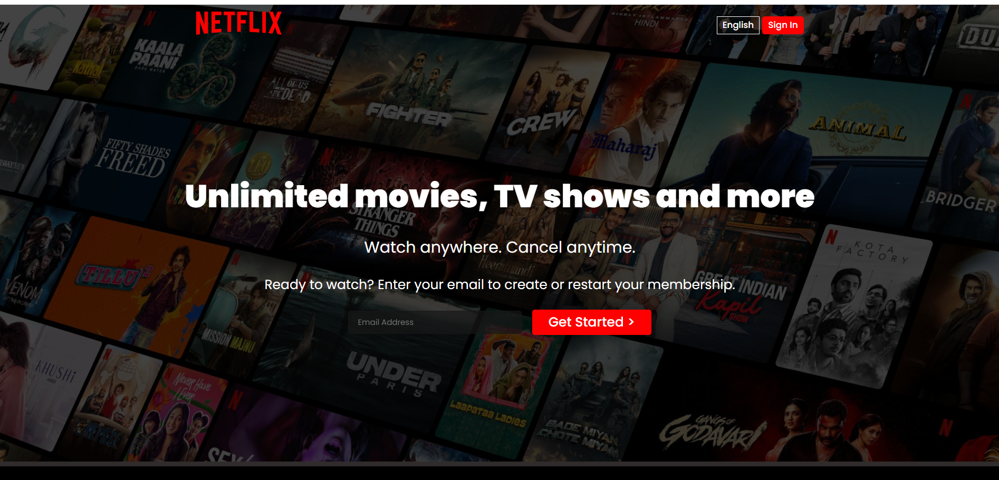
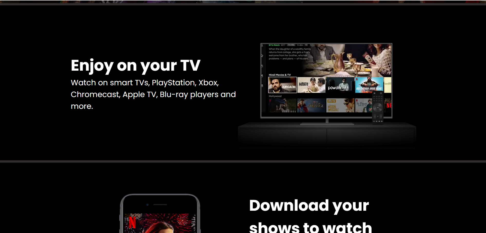
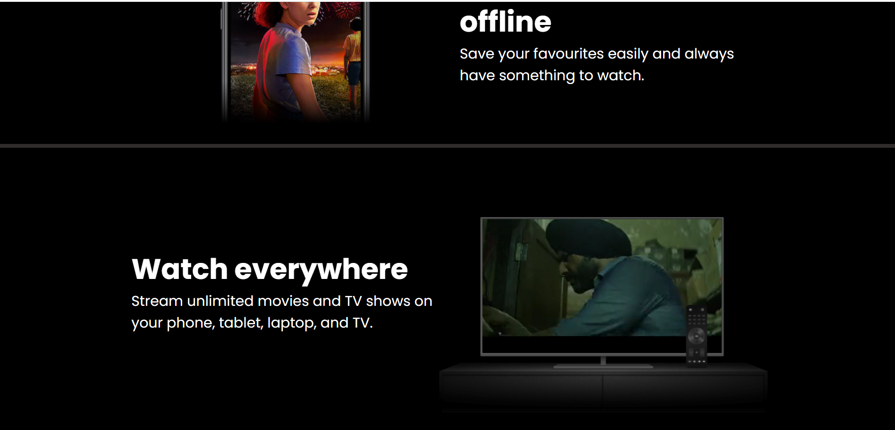
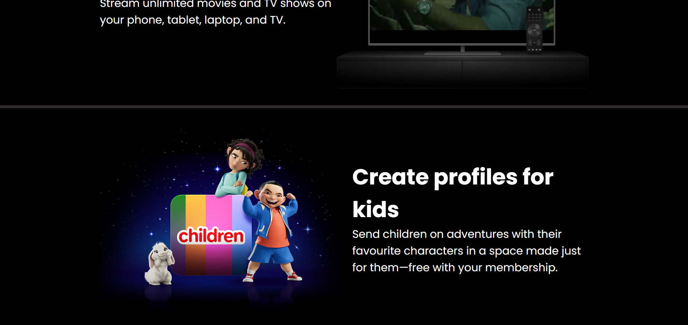
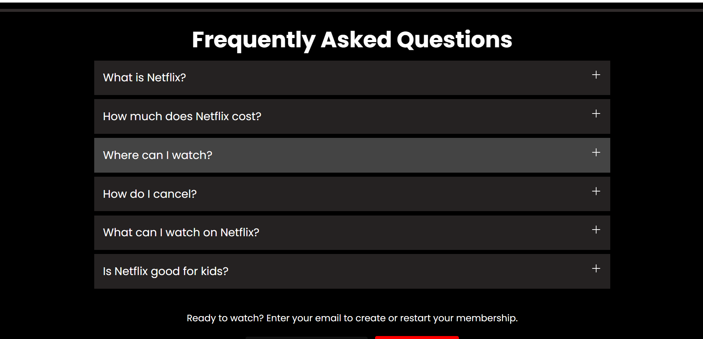
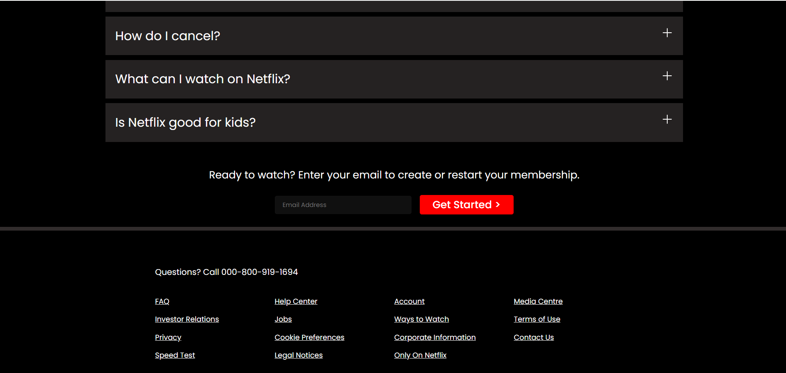

# Netflix Clone Landing Page

## Description
This project is a clone of the Netflix landing page, created using HTML and CSS. The objective of this project is to practice and showcase skills in web design and front-end development. The clone aims to replicate the look and feel of the original Netflix landing page, including its layout, typography, and styling.

## Technologies Used
- HTML
- CSS

## Screenshot
- **Screen1:**

- **Screen2:**

- **Screen3:**

- **Screen4:**

- **Screen5:**

- **Screen6:**

## How to View
To view the Netflix clone landing page, simply open the `index.html` file in a web browser.

## Features
- Responsive design that adapts to different screen sizes
- Accurate replication of Netflix's landing page layout and style
- Use of modern CSS techniques for styling and layout
